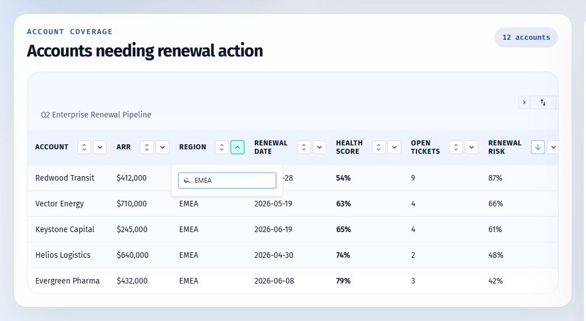
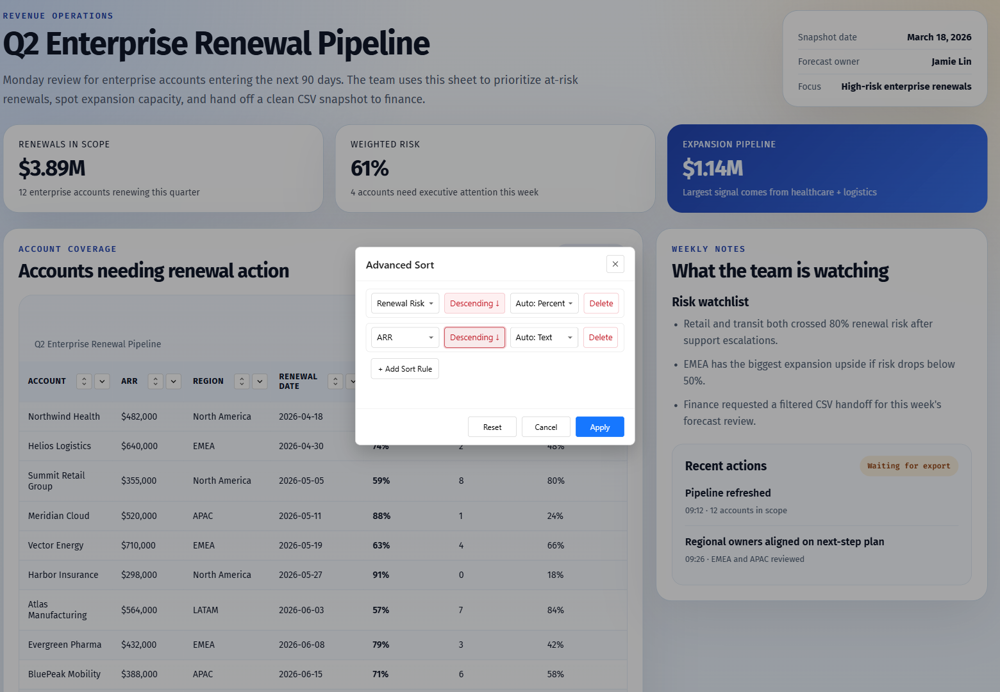
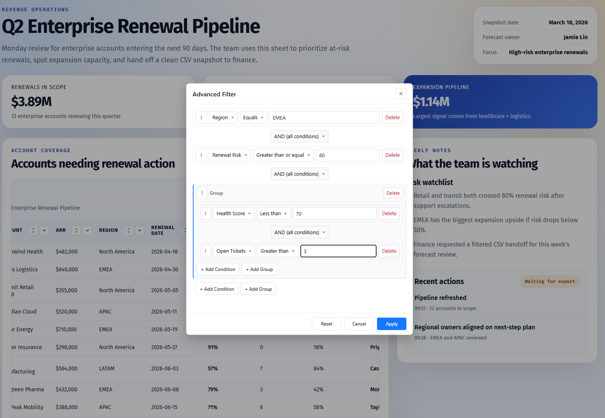
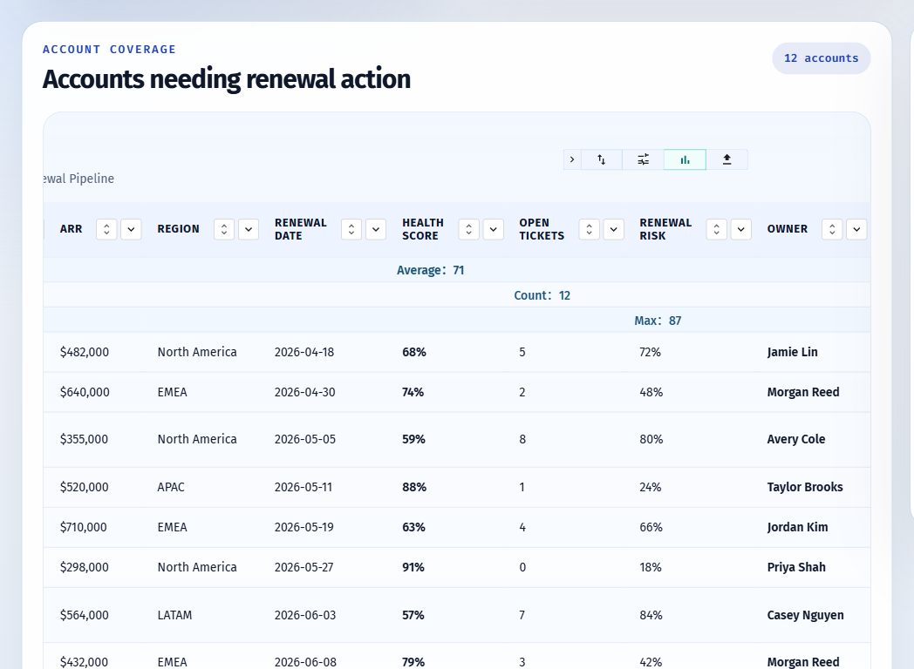
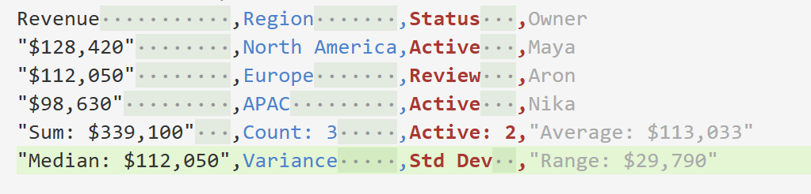

  

<h1 align="center">AnyTable</h1>

  
  
  

  <b>语言</b>: <a href="../../README.md">English</a> | 简体中文

---

增强你的网页表格处理

## 概述

AnyTable 是一个轻量，简洁，高性能的浏览器扩展。它把表格的排序、筛选、统计和 CSV 导出功能直接带到页面中，让你直接在浏览器中快速处理数据。

## 你可以用 AnyTable 做什么

- 快速、简单的排序和筛选。
- 使用高级排序进行多列优先级排序，并支持丰富的单位数据排序与自动类型识别。
- 使用高级筛选创建可嵌套的条件组合，支持跨多列的复杂逻辑筛选。
- 生成统计行，支持计数、总和、平均值、中位数、方差等多种统计维度。
- 将当前表格视图导出为 CSV。
- 支持监听页面变化，自动增强后续出现的表格。
- 支持多种非标准表格，例如单元格合并、宽表头、嵌套表格等场景。

## 功能预览

### 快速排序 / 筛选

> 直接在表头旁完成日常排序和筛选操作。
>
> 

### 高级排序

> 通过多列优先级、排序方向和类型识别完成更复杂的排序规则。
>
> 

### 高级筛选

> 用嵌套条件组构建更灵活的复杂筛选流程。
>
> 

### 统计功能

> 为当前表格视图追加统计结果，并始终贴近原始数据展示。
>
> 

### 导出 CSV

> 一键导出当前可见表格数据。
>
> 

## 获取 AnyTable

| 渠道 | 适合场景 | 安装入口 |
| --- | --- | --- |
| Firefox | 从官方 Firefox 商店直接安装 | [Firefox Add-ons](https://addons.mozilla.org/en-US/firefox/addon/anytable) |
| Chrome | 从官方 Chrome 商店直接安装 | [Chrome Web Store](https://chromewebstore.google.com/detail/anytable/dbadglamnjdkmadaocimiijibamaghkk) |
| Edge / Brave / Vivaldi / Arc | 大多数基于 Chromium 的浏览器 | 可先尝试通过 Chrome Web Store 安装 |
| 手动安装包 | 浏览器不支持直接商店安装、离线安装或手动部署 | [GitHub Releases](https://github.com/idealhs/AnyTable/releases) |

### 在其他浏览器中安装

对于大多数基于 Chromium 的浏览器，AnyTable 通常也可以正常使用，可以尝试通过 [Chrome Web Store](https://chromewebstore.google.com/detail/anytable/dbadglamnjdkmadaocimiijibamaghkk) 安装

1. 如果无法直接安装，请前往 [GitHub Releases](https://github.com/idealhs/AnyTable/releases) 下载最新发布包。
2. 解压下载的 ZIP 文件。
3. 打开浏览器的扩展管理页面，并开启开发者模式。
4. 选择“加载已解压的扩展程序”、“安装已解压扩展”或浏览器中的同类选项。
5. 选择解压后的扩展目录，完成安装。

## 许可证

GNU General Public License v3.0 (`GPL-3.0`)
